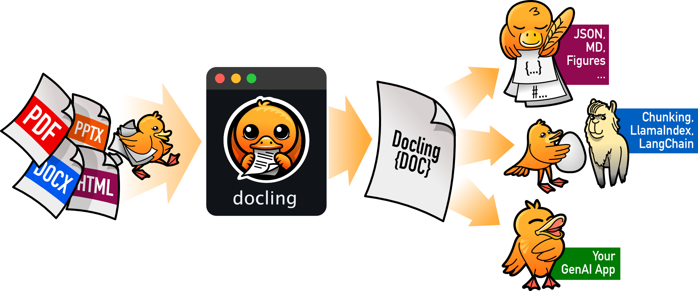

# Docling Testing

This repository demonstrates how to use Docking for document conversion (PDF, HTML, etc.) to structured formats like Markdown and JSON.

The use I have for docling is particularly for tables.

## Installation

1. Clone the repository:

```bash
git clone https://github.ibm.com/Quentin-Lefevre/docling-testing.git

cd docling-testing
```

2. Install dependencies:

```bash
pip install -r requirements.txt
```

## Usage

Run examples in the examples/ folder to test different document types:

```bash
docling /copy/the/path/assets/maintenance-auto.pdf --to md --no-ocr

docling /copy/the/path/assets/meteo_montpellier.html --to md --ocr
```

Note that the ‘ocr’ option almost never works with pdf files...

## Jupyter Notebook

Use the notebook in notebook/guide.ipynb to see my tests and results.
